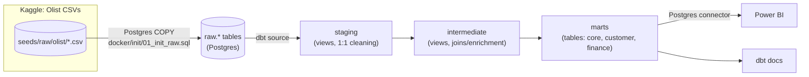
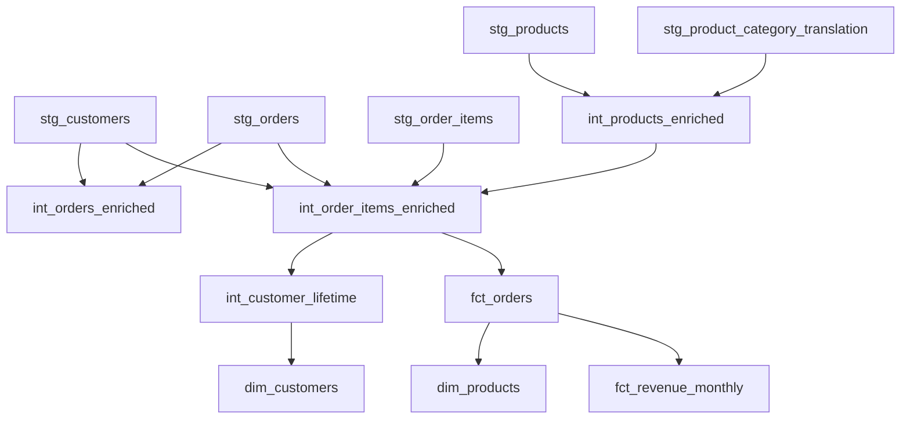

# E-Commerce Analytics Mart


<!-- Replace <GITHUB_USERNAME>/<REPO_NAME> once this repo has a remote. -->

A dbt project turning the real [Olist Brazilian E-Commerce dataset](https://www.kaggle.com/datasets/olistbr/brazilian-ecommerce)
(Kaggle) into a single source of truth for revenue, customers, and product
performance. **No synthetic or generated data is used anywhere.**

## Table of contents

- [Overview](#overview)
- [Architecture](#architecture)
- [Data lineage](#data-lineage)
- [Technologies](#technologies)
- [Folder structure](#folder-structure)
- [Key design decisions](#key-design-decisions)
- [Local setup](#local-setup)
- [CI](#ci)
- [Testing & data quality](#testing--data-quality)
- [dbt docs](#dbt-docs)
- [Power BI dashboard](#power-bi-dashboard)
- [Lessons learned](#lessons-learned)

## Overview

Three consumer-facing marts, all derived from the same real order-item data
with a single revenue definition:

- **`fct_orders`** (`marts/core`) — order-line grain fact table.
- **`dim_products`** (`marts/core`) — product dimension with sales rollups.
- **`dim_customers`** (`marts/customer`) — customer lifetime value/recency.
- **`fct_revenue_monthly`** (`marts/finance`) — the official monthly revenue metric layer.

## Architecture



Full write-up (including *why* each architectural choice was made): [`docs/overview.md`](docs/overview.md).

## Data lineage



This is a simplified, hand-maintained summary — the authoritative,
always-current lineage graph is the interactive DAG in `dbt docs generate`
(see [dbt docs](#dbt-docs) below).

## Technologies

| Tool | Role |
|---|---|
| [dbt-core](https://github.com/dbt-labs/dbt-core) 1.8.x + `dbt-postgres` | Transformation, testing, documentation |
| PostgreSQL 16 | Warehouse |
| Docker Compose | Local Postgres + pgAdmin |
| pgAdmin | Database browser |
| GitHub Actions | CI (build + test + docs on every push/PR) |
| Power BI | BI layer, connects to the `marts` schema only |
| `dbt_utils` | Generic test macros (`accepted_range`, `unique_combination_of_columns`, etc.) |

## Folder structure

```
models/
  staging/        stg_*        1:1 cleaned mapping of raw Olist tables, no joins
  intermediate/    int_*        joins/enrichment, no KPI calculations
  marts/
    core/          fct_orders, dim_products
    customer/      dim_customers
    finance/       fct_revenue_monthly
  marts/_exposures.yml   Power BI exposure declaration
seeds/raw/olist/   real Olist CSVs (git-tracked), loaded via docker/init/01_init_raw.sql
seed_data/         empty on purpose - see dbt_project.yml comment on seed-paths
docker/init/       Postgres bootstrap: creates `raw` schema, COPYs the CSVs in
tests/             singular data-quality tests + their documentation (_tests.yml)
macros/            order_line_revenue() (the one revenue formula), no_negative_revenue
                    generic test, both documented in macros/_macros.yml
docs/overview.md    dbt doc blocks: architecture, lineage, KPI + grain definitions
```

Full per-file breakdown: [`docs/overview.md`](docs/overview.md#folder-structure).

## Key design decisions

These are covered in depth in [`docs/overview.md`](docs/overview.md); summarized here:

- **Order-line grain for `fct_orders`**, not order-level — no information
  loss, and every downstream model (`dim_products`, `fct_revenue_monthly`)
  aggregates up from one single grain instead of each reinventing its own
  rollup.
- **`customer_unique_id`, not raw `customer_id`, for `dim_customers`** —
  Olist mints a new `customer_id` per order, so aggregating on it would
  make every customer show exactly 1 lifetime order. `dim_customers.customer_id`
  is populated from `customer_unique_id`; join it to `fct_orders` via
  `fct_orders.customer_unique_id = dim_customers.customer_id`.
- **Revenue = `price + freight_value`**, defined once in
  `fct_orders.revenue` via the `order_line_revenue()` macro. Every other
  revenue-shaped number (`lifetime_spend`, `total_revenue`) is a `sum()` of
  that column, never a redefinition.
- **Active customer** = distinct `customer_unique_id` with at least one
  order line purchased in the given month, regardless of order status. See
  [Known Data Quality Findings](#testing--data-quality) for why order
  status isn't filtered.
- **Raw CSVs via Postgres `COPY`, not `dbt seed`** — `dbt seed` inserts
  row-by-row and doesn't scale to Olist's 100k+ row tables (an early
  version of this project auto-seeded them by accident and a `dbt build`
  went from ~2 seconds to ~200+ seconds; see [Lessons learned](#lessons-learned)).
- **`table`, not `incremental`, materialization for marts** — Olist is a
  static historical extract with no new orders landing daily, and the full
  rebuild costs a couple of seconds. Revisit if this ever becomes a live
  feed.

## Local setup

1. Get the real data (already done if you have `seeds/raw/olist/*.csv`):
   ```bash
   kaggle datasets download -d olistbr/brazilian-ecommerce -p seeds/raw/olist --unzip
   ```
2. Start Postgres + pgAdmin (Postgres auto-loads the raw CSVs on first boot
   via `docker-entrypoint-initdb.d`):
   ```bash
   docker compose up -d postgres pgadmin
   ```
3. Run dbt against it — either from your host (with `dbt-postgres` installed
   and env vars set per `.env.example`) or inside the provided container.
   **Pin `dbt-core`/`dbt-postgres` to `<1.9`** — newer releases can resolve
   to the "Fusion" engine preview, which doesn't support the Postgres
   adapter yet (see [Lessons learned](#lessons-learned)):
   ```bash
   docker compose up -d dbt
   docker compose exec dbt bash -c "dbt deps && dbt build"
   docker compose exec dbt dbt docs generate
   docker compose exec dbt dbt docs serve --port 8081
   ```
4. pgAdmin: http://localhost:8080 (login via `PGADMIN_EMAIL`/`PGADMIN_PASSWORD`,
   defaults `admin@admin.com` / `admin`). Add a server pointing at host
   `postgres`, port `5432`, db `olist`.
5. Power BI / any BI tool: connect to Postgres `localhost:5432`, database
   `olist`, schema `marts` only.

### Resetting the database

The raw CSVs are loaded once, on the Postgres container's first boot, via
`docker-entrypoint-initdb.d`. To reload from scratch:
```bash
docker compose down -v   # drops the pgdata volume
docker compose up -d postgres
```

## CI

`.github/workflows/ci.yml` runs on every push and pull request against
`main`:

1. Spins up a disposable Postgres 16 service container.
2. Loads the real Olist CSVs into it using the *exact same*
   `docker/init/01_init_raw.sql` script used locally (single source of
   truth for the raw-load logic, no drift between local and CI).
3. Installs `dbt-postgres` (pinned `<1.9`) and runs `dbt deps`.
4. Runs `dbt build` — models + all data tests, in DAG order.
5. Runs `dbt docs generate` to confirm the docs site still builds.

CI is expected to pass fully except the documented `customer_spend_accuracy`
warning (see below) — that's a `WARN`, not an `ERROR`, so it doesn't fail
the build.

## Testing & data quality

- **Generic**: `not_null`, `unique`, `relationships`,
  `dbt_utils.accepted_range`, `dbt_utils.unique_combination_of_columns`.
- **Custom generic**: `no_negative_revenue` (`macros/tests/`) — applied to
  every price/freight/revenue/spend column across the marts.
- **Custom singular** (documented in `tests/_tests.yml`):
  - `order_revenue_consistency` (**error**) — `fct_orders.revenue` summed
    per order must exactly match `price + freight_value` summed
    independently from `stg_order_items`. Both sides derive from the same
    source rows with no aggregation in between, so any drift means a join
    upstream fanned rows out - a pipeline bug, not a real-world issue.
  - `customer_spend_accuracy` (**warn**) — `dim_customers.lifetime_spend`
    vs. actual amounts paid (`olist_order_payments`).

### Known data quality findings

`customer_spend_accuracy` currently flags **293 of 95,420 customers
(~0.3%)** where the amount they actually paid diverges from their
item-based spend by more than 5% (or R$1, whichever is larger). This is
**expected and intentionally not suppressed** — Olist's `payment_value`
can legitimately include installment interest, vouchers, or gift cards
that don't map 1:1 onto `price + freight_value`. The test is configured as
`warn`, not `error`, specifically so this real, documented data
characteristic is visible in every `dbt build` without blocking CI. If
this number grows significantly between runs, that's the signal worth
investigating - not the existing 293.

`active_customers` (`fct_revenue_monthly`) does not filter on
`order_status`, so a canceled order still counts a customer as active in
that month. This mirrors Olist's raw order_items grain (no status
filtering happens anywhere in this project's revenue calculation either -
see [revenue definition](#key-design-decisions)) and keeps the "active"
and "revenue" definitions consistent with each other. A status-filtered
variant would be a legitimate second metric, not a fix - see docs/overview.md.

## dbt docs

Generate and browse the interactive docs site (models, columns, tests,
sources, exposures, and the full DAG):

```bash
dbt docs generate
dbt docs serve --port 8081
```

> 📸 *Screenshot placeholder — add a screenshot of the generated docs site
> here (e.g. the `fct_orders` model page and the lineage graph) once you've
> run `dbt docs serve` locally.*

## Power BI dashboard

Not yet built. Declared as an exposure in
[`models/marts/_exposures.yml`](models/marts/_exposures.yml) so the mart's
downstream consumer is documented even before the report exists — connects
to the `marts` schema only.

> 📸 *Screenshot placeholder — add dashboard screenshots here once built
> (e.g. revenue trend, customer LTV distribution, top product categories).*

## Lessons learned

- **A source's grain quirks can silently break a KPI even when every dbt
  test passes.** Olist's `customer_id` being order-scoped (not
  person-scoped) wouldn't have failed `unique`/`not_null` tests if
  `dim_customers` had been built on it directly — the numbers would just
  have been meaningless (`lifetime_orders = 1` for everyone). Knowing the
  source data mattered more than any generic test here.
- **`dbt seed` and bulk raw-data loading are different jobs.** Letting
  dbt's default `seed-paths` auto-discover the raw CSV cache turned a
  ~2 second `dbt build` into ~200+ seconds, loading tables (like a
  1M-row geolocation extract) that no model even used. Bulk-loading real
  extracts belongs in the warehouse layer (Postgres `COPY`), consumed via
  `dbt source()`; `dbt seed` is for small, static reference data.
- **Pin dbt versions explicitly.** `pip install dbt-postgres` alone
  resolved to a `dbt-core` 2.0 alpha ("Fusion") that doesn't support the
  Postgres adapter yet, and separately to a 1.12 beta with unrelated
  Python 3.14 compatibility issues. Pinning `dbt-core`/`dbt-postgres` to
  `<1.9` (the last fully-stable classic-engine line as of this project)
  avoided both.
- **A single revenue macro is worth the indirection.** Routing every
  revenue calculation through `order_line_revenue()` meant the monthly
  rollup, customer lifetime spend, and the fact table itself can never
  drift from each other by definition, not by convention.
- **Not every test needs to pass at zero.** `customer_spend_accuracy` is
  designed to *find* real reconciliation gaps in payment data, not to
  reach zero results - documenting and warning on it beats either
  suppressing it or wrongly treating it as a bug to "fix" until it's green.

## Naming conventions

Staging models are named `stg_<entity>` (e.g. `stg_customers`) rather than
`stg_<source>__<entity>`. dbt Labs' convention adds the source prefix to
disambiguate when a warehouse ingests the same entity from multiple
systems; this project has exactly one source (Olist), so the prefix would
add noise without disambiguating anything. Revisit if a second source is
ever added.
