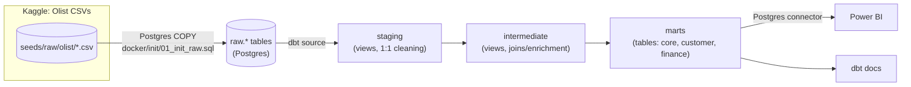
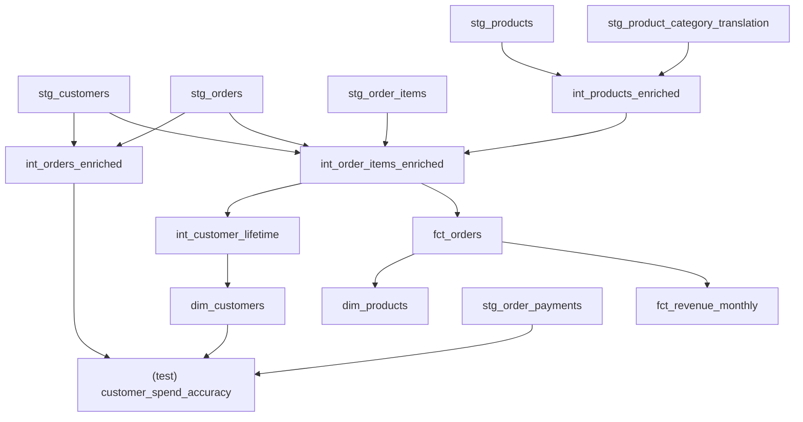



# E-Commerce Analytics Mart

A single source of truth for revenue, customers, and product performance,
built on the real [Olist Brazilian E-Commerce dataset](https://www.kaggle.com/datasets/olistbr/brazilian-ecommerce).
No synthetic or generated data is used anywhere in this project.

## Architecture

Raw CSVs are bulk-loaded with Postgres `COPY` (not `dbt seed` — see
`dbt_project.yml` for why), then every transformation from there on is a
plain dbt model. Power BI and any other BI tool connect **only** to the
`marts` schema, never to `staging`/`intermediate`/`raw`.

## Data lineage (layer to layer)

This is a simplified, hand-maintained summary. The authoritative, always
up-to-date lineage graph is the DAG in `dbt docs generate` (see README for
how to view it) — trust that one if this diagram and the code ever
disagree.

## Folder structure

| Path | Purpose |
|---|---|
| `models/staging/` | `stg_*` — 1:1 cleaned mapping of each raw Olist table. No joins, no business logic. |
| `models/intermediate/` | `int_*` — joins between staging models to enrich rows with context (categories, customer identity, order status). Still no KPI calculations. |
| `models/marts/core/` | `fct_orders`, `dim_products` — the order-line fact and product dimension. |
| `models/marts/customer/` | `dim_customers` — customer lifetime metrics. |
| `models/marts/finance/` | `fct_revenue_monthly` — the official monthly revenue rollup. |
| `seeds/raw/olist/` | Cached real Olist CSVs (git-tracked, ~120MB). Loaded into Postgres via `docker/init/01_init_raw.sql`, not `dbt seed`. |
| `seed_data/` | Empty on purpose — dbt's configured `seed-paths`, kept separate from `seeds/raw` so `dbt build`/`dbt seed` don't try to bulk-INSERT the 100k+ row raw CSVs. |
| `docker/init/` | Postgres bootstrap SQL: creates the `raw` schema and `COPY`s the CSVs in. |
| `macros/` | `order_line_revenue()` (the single revenue formula) and the custom `no_negative_revenue` generic test. |
| `tests/` | Singular data-quality tests: `order_revenue_consistency`, `customer_spend_accuracy`. |
| `docs/overview.md` | This file — dbt doc blocks for KPI/grain definitions, referenced from schema.yml files via the `doc()` function. |

## Why order-line grain for `fct_orders`

Olist's `order_items` table is naturally one row per unit purchased
(an order with 3 different items, or 2 units of the same item, produces
multiple rows). `fct_orders` keeps that grain instead of collapsing to
one-row-per-order for two reasons:

1. **No information loss.** Rolling up to order-level in the fact table
   would discard per-line detail (which product, what price) that
   `dim_products` and any future product-level analysis need. It's always
   possible to aggregate order-line grain up to order-level (as
   `fct_revenue_monthly` does); the reverse is not possible.
2. **One grain, one place.** Every other model (`dim_products`,
   `fct_revenue_monthly`) aggregates from `fct_orders` rather than
   redefining price/revenue logic at a different grain. Keeping the fact
   table at the finest available grain avoids each downstream consumer
   inventing its own rollup.

See [fct_orders](#!/model/model.ecommerce_analytics_mart.fct_orders) for the full grain note.

## Revenue definition

See [revenue_definition](#!/doc/ecommerce_analytics_mart/revenue_definition). There is exactly one revenue formula in this
project (`price + freight_value`), defined once in `fct_orders` and never
redefined downstream — `dim_customers.lifetime_spend` and
`fct_revenue_monthly.total_revenue` are both derived by summing
`fct_orders.revenue`, not recomputed independently.

## Active customer definition

See [active_customer_definition](#!/doc/ecommerce_analytics_mart/active_customer_definition).

## The customer_id / customer_unique_id nuance

Olist's raw `customer_id` is minted fresh for every order — the same
shopper gets a new `customer_id` each time they buy. `customer_unique_id`
is the durable, cross-order identifier for the actual person. Any model
here that measures "lifetime" behavior (`dim_customers`) is built on
`customer_unique_id`; anything at order-line grain (`fct_orders`) carries
both, so the two can still be joined correctly. See `stg_customers` docs
for details.

**Why this matters in practice**: if `dim_customers` were built on the raw,
order-scoped `customer_id` instead, every single customer would show
`lifetime_orders = 1` (since Olist never reuses `customer_id` across
orders), silently making the entire "lifetime" concept meaningless while
still passing every generic dbt test (unique, not_null, etc. would all
pass — this is a correctness bug that tests alone don't catch, only
knowing the source data does).

## How to run locally

See `README.md` → "Local setup". Short version: load the real CSVs into
Postgres (`docker compose up -d postgres` or the equivalent local-Postgres
path), then `dbt deps && dbt build && dbt docs generate`.

## How CI works

See `README.md` → "CI". Short version: `.github/workflows/ci.yml` spins up
a disposable Postgres service container, loads the same real CSVs via the
same `docker/init/01_init_raw.sql` script, then runs `dbt build` (models +
tests) and `dbt docs generate` on every push and pull request against
`main`.




Revenue for a single order line is defined as `price + freight_value`
(the item price plus the shipping cost allocated to that line). This is
the ONLY revenue definition in the project. `fct_orders.revenue` computes
it once; every other revenue-shaped number downstream (customer lifetime
spend, monthly revenue) is a straight `sum()` of that same column.



Sum of `fct_orders.revenue` (price + freight_value) across every order
placed by the customer (aggregated on `customer_unique_id`). This is a
real calculation over the full order-item history, not an estimate.



Days between the customer's `last_order_date` and the most recent
`order_purchase_timestamp` observed anywhere in the dataset. Olist's data
is a static 2016-2018 historical extract rather than a live feed, so
recency is anchored to the dataset's own "as of" date rather than
`CURRENT_DATE` — otherwise every customer would show ~3000 days of
recency with no differentiation.



A customer (identified by `customer_unique_id`, not the order-scoped raw
`customer_id`) is counted as "active" in a given calendar month if they
have at least one order line in `fct_orders` with an
`order_purchase_timestamp` falling in that month. A customer who places
multiple orders in the same month is still counted once
(`count(distinct customer_unique_id)`); a customer who orders in two
different months is counted once in each of those months. This definition
does not consider order status (e.g. a canceled order still counts) - see
the Known Data Quality Findings section of the README for the reasoning
and the tradeoff.



**Grain: one row per order line** (`order_id`, `order_item_id`) — i.e. one
row per unit purchased, not one row per order. An order with 3 items
produces 3 rows here. This is the core fact table; `dim_products` and
`fct_revenue_monthly` both aggregate from it rather than recomputing
price/revenue independently. See [revenue_definition](#!/doc/ecommerce_analytics_mart/revenue_definition)
and the "Why order-line grain" section of the project overview.



**Grain: one row per product.** `avg_price` and `total_units_sold` are
aggregated from `fct_orders`, so they reflect only products that have
actually sold at least once (products with no sales show `avg_price = 0`,
`total_units_sold = 0`).



**Grain: one row per customer**, keyed on Olist's `customer_unique_id`
(aliased to the `customer_id` column) rather than the order-scoped raw
`customer_id`. See the `customer_id` / `customer_unique_id` nuance in the
project overview for why this distinction matters.



**Grain: one row per calendar month.** The only official revenue metric
layer in this project — `total_revenue` is a `sum()` of `fct_orders.revenue`,
never a redefinition of it. See [active_customer_definition](#!/doc/ecommerce_analytics_mart/active_customer_definition)
for exactly how `active_customers` is counted.

